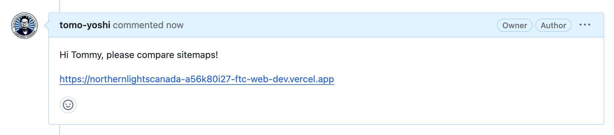
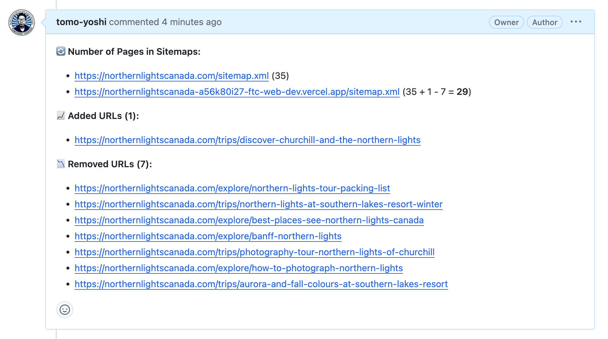
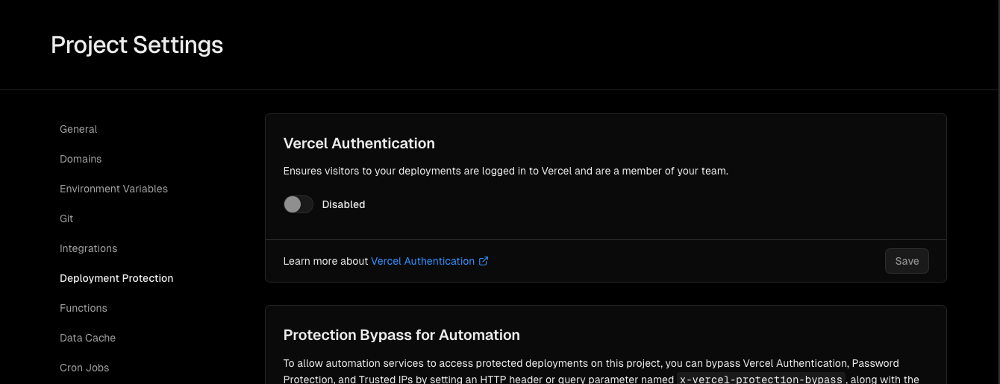

# Compare Sitemaps JS

## About this Project

This code is supposed to be used as a serverless function deployed to GCP. The function is to compare sitemaps and post a summary on GitHub PR. 

This function helps compare sitemaps between the production and the preview environments in QA. You no longer have to visit sitemap pages and compare them with your eyes.


## Table of Contents
1. [Tech Stack](#tech-stack)
2. [How to Use](#how-to-use)
3. [Setup](#setup)
    1. [Code](#code)
    2. [Vercel](#vercel)
4. [Deployment](#deployment)
    1. [GCP](#gcp)
    2. [Deploy the Function](#deploy-the-function)


## Tech Stack

<div align="center">
	<table>
		<tr>
			<td><code></code></td>
			<td><code></code></td>
			<td><code></code></td>
			<td><code></code></td>
		</tr>
	</table>
</div>

- **TypeScript**: Core programming language.
- **Node.js**: Runtime environment for executing JavaScript code.
- **Google Cloud Functions**: Serverless execution environment for deploying the function.
- **GitHub API**: For posting comments on pull requests.


## How to Use
Add a comment with specific keywords and URL in Github PR

(In the example image below, the keywords are "tommy," "compare," and "sitemap.")



Then, a comment will be returned, like the image below:



### Demo

On [this page](https://github.com/), please post the comment below:

```py
Hi Tommy, please compare sitemaps!

https://northernlightscanada-a56k80i27-ftc-web-dev.vercel.app
```

You are not able to compare sitemaps of your preview website with production one because `URL_PAIRS` should be set up in the code.

## Setup

### Code

1. Update `config.ts` file
- `ALLOWED_ORIGINS`:
    ```ts
    ALLOWED_ORIGINS = [
        'https://api.github.com',
    ]
    ```
    
    No need to update as long as you want to use this function for Github webhooks

- `KEYWORDS`:
    ```ts
    KEYWORDS = ['tommy', 'compare', 'sitemap']
    ```

    List all keywords that should be included in a comment to execute this function

- `URL_PAIRS`:
    ```ts
    URL_PAIRS = {
        'https://canadiantrainvacations.com': 'canadiantrainvacations',
        'https://canadapolarbears.com': 'canadapolarbears',
        'https://northernlightscanada.com': 'northernlightscanada',
        'https://freshtrackscanada.com': 'freshtrackscanada'
    }
    ```

    Key should be a production (base) URL while a value should be a keyword included in a preview URL


2. Issue Github Token (classic)

    Select the following scopes:

    - **repo** (Full control of private repositories)
    - **write:discussion** (Read and write team discussions)

### Vercel
- Turn off "Vercel Authentication" in Deployment Protection to allow the endpoint to access preview pages



## Deployment

### GCP

#### Prerequisit

- Created a GCP Project
- Enabled the Cloud Functions API:
    - In the GCP Console, navigate to APIs & Services > Library.
    - Enable the Cloud Functions API.
- Installed the Google Cloud SDK
    - Downloaded and installed the Google Cloud SDK
    - Initialized the SDK:

    ```
    gcloud init
    ```
    (Follow the prompts to select your project and set up your environment.)


### Deploy the Function

Please replace `your-github-token` with at the end of the following command.


```
gcloud functions deploy compareSitemapsJs \
  --runtime nodejs20 \
  --trigger-http \
  --allow-unauthenticated \
  --entry-point=compareSitemap \
  --region=us-central1 \
  --set-env-vars GITHUB_TOKEN=your-github-token
```